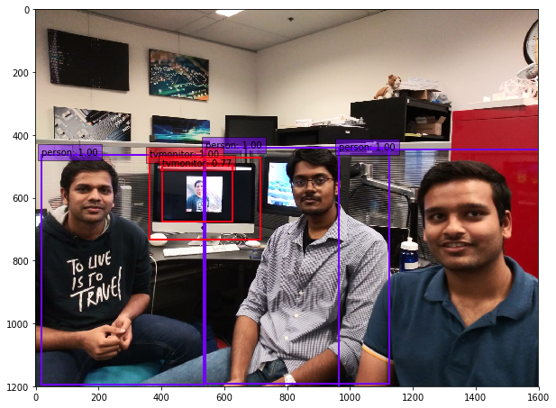

# ECE 285 UCSD - Spring '19 - Final project - Team Graduate Descent 

# Input New York City Walking Tour Videostream
[ ](https://www.youtube.com/watch?v=u68EWmtKZw0) 

# Clean Videostream object detected


# Noisy Videostream object detected


# Denoised Videostream object detected


# Single Shot Detector 
A PyTorch implementation of the SSD Multibox Detector for image feature extraction, based on the 2016 [Arxiv](http://arxiv.org/abs/1512.02325) paper by Wei Liu, Dragomir Anguelov, Dumitru Erhan, Christian Szegedy, Scott Reed, Cheng-Yang, and Alexander C.
## Table of contents
- Installation
- Datasets
- Training
- Evaluation
- Performance
- Directory structure
- References
### Installation
To install Python dependencies and modules, use <br>
```pip install -r requirements.txt``` <br>
You can either choose to train the net yourself (preferrably with a CUDA GPU), or download pretrained weights files (\*.pth) from the weights/ folder.
### Datasets
[2012 version](http://host.robots.ox.ac.uk/pascal/VOC/voc2012/) of Pascal VOC dataset - well known dataset for object detection/classification/segmentation. Contains 100k images for training and validation containing bounding boxes with 20 categories of objects.
### Training
Do ```python train.py``` with parameters listed in the file as a flag or pass your own parameters.
#### NOTE: NVIDIA/CUDA enabled GPU is recommended for speed.
### Evaluation
Do ```python eval.py``` with parameters listed in the file as a flag or pass your own parameters.
### Performance <br>
On [UCSD Data Science and Machine Learning Cluster](https://datahub.ucsd.edu/hub/home):

| Category  | Clean Image (mAP) | Noisy Image (mAP) | Denoised Image (mAP) |
| ------------- | ------------- | ------------- | ------------- |
| Training  |  88.19% | 52.73% | 73.78% | 
| Evaluation  | 77.43% | 46.47% | 61.84% |

### Directory structure
- pycache/ - .pyc files for Python interpreter to compile the source to
- data/ - 
  - pycache/ - .pyc files for Python interpreter to compile the source to
  - init.py - contains instances:
    - function detection_collate - stack images in 0th dimension and list of tensors with annotations for image and return in tuple format, given tuple of tensor images and list of annotations
    - function base_transform - resize and mean-normalize image
    - class BaseTransform - call base_transform(image) iteratively
  - config.py - configures VOC dataset with source directory, mean values, color ranges and SSD parameters
  - voc0712.py - configures VOC dataset with labels considered, and contains instances:
    - class VOCAnnotationTransform - store dictionaries of classname:index mappings, with an option to discard difficult instances
    - class VOCDetection - update and store annotation based on input image, with functions to get item, pull item, image, annotation and tensor
- demos/ - demo gifs to show performance of SSD on noisy, clean and denoised video streams (source files for the .gifs shown above)
- \*_experiments/ - experiments folders for denoising, optimization and video performance evaluation
  - .ipynb_checkpoints/ - checkpoints folder for modular running of python notebooks
  - \*.ipynb - jupyter notebooks to visualize descent of loss, other evaluation metrics
  - \*.jpeg - plots of loss functions in different scenarios
  - pickles/ - pickle files for easy storing of data during cross validation (different learning rates, momentums etc.)
  - pycache/ - .pyc files for Python interpreter to compile the source to
  - NOISE_PARAMS.pkl - Pickle file for noise parameters
  - nntools.py - class script for base classes to implement neural nets, evaluate performance, specify metrics etc.
- devkit_path / -
  - annotations_cache/ - 
    - annots.pkl - Pickle file for annotations
  - results/ - result files for each class
- eval/ -
  - test1.txt - ground truth bbox vales and predictions for a selected portion of VOC dataset
  - test1_Denoise.txt - ground truth bbox vales and predictions for a selected portion of the VOC dataset AFTER noising and denoising
- layers/ -
  - pycache/ - .pyc files for Python interpreter to compile the source to
  - functions/ -
    - pycache/ - .pyc files for Python interpreter to compile the source to
    - init.py - import all files in pwd
    - detection.py - contains instances:
      - class Detect - enable decoding of location predictions of bboxes and apply NMS based on confidence values and threshold; restrict to tok_k output predictions to reduce noise in results quality (not actual image noise)
        - function init - allocate memory and initialize
        - function forward - forward propagation to update layers given input location prediction, confidence and prior data from their respective layers
    - prior_box.py - contains instances:
      - class PriorBox - collate and store priorbox coordinates in center-offset form and tie it to each source feature map
        - function init - allocate memory and initialize
        - forward - forward propagation through priorbox layers
  - modules/ -
    - pycache/ - .pyc files for Python interpreter to compile the source to
    - init.py - import all files in pwd
    - l2norm.py - contains instances:
      - class L2Norm - calculate L2 norm and normalize
        - function init - allocate memory and initialize
        - forward - compute the norm and return
    - multibox_loss.py - contains instances:
      - class MultiBoxLoss - compute targets for confidence and localization and apply HNM; using a loss function that is weighted between the cross entropy loss and a smooth L1 loss (weights were found during cross validation)
        - function init - allocate memory and initialize
        - function forward - forward propagate through multibox layers, given tuple of location and confidence predictions, prior box values and ground truth boxes and labels in tensor format
  - init.py - import all files in pwd
  - box_utils.py - contains instances:
    - function point_form - convert prior box values from center-size format for easy comparison to point form ground truth data
    - function center_size - convert prior box values to center-size format for easy comparison to center-size ground truth data
    - function intersect - compute area of intersection between two given boxes
    - function jaccard - compute jaccard overlap or intersection over union of two boxes
    - function match - match prior box with ground truth box (for all boxes) based on highest jaccard overlap, encode in required format (point-form or center-size), and return matching indices for the given confidence and location predictions
    - function encode - encode variances from prior box layers into ground truth boxes
    - function decode - decode locations from priors and locations and return bbox predictions
    - function log_sum_exp - compute log of sum of exponent of difference between current tensor and maximum value of tensor, for unaveraged confidence loss
    - function nms - compute non-maximum suppression to avoid too many overlapping bboxes that highlight nearly the same area
- out/ - output pickle files organized by the 20 VOC classes
- train_eval_test_notebooks/ - training and evaluation notebooks for loss fn visualization
- utils/ -
  - pycache/ - .pyc files for Python interpreter to compile the source to
  - init.py - import all in pwd
  - augmentations.py - contains instances:
    - function intersect - return intersection of two given bounding boxes
    - function jaccard_numpy - return IoU or jaccard overlap of two given bounding boxes
    - class Compose - definitions of different transforms to perform
    - class Lambda - applies a lambda as a transform
    - class ConvertFromInts - convert object from integers
    - class SubtractMeans - subtract mean of image from passed image for normalization
    - class ToAbsoluteCoords - convert lengths (widths, heights) to absolute coordinates
    - class ToPercentCoords - convert coordinates to percentage values of image height and width
    - class Resize - resize image
    - class RandomSaturation - randomly saturate an image
    - class RandomHue - add a random hue to an image
    - class RandomLightingNoise - add random lighting noise to an image
    - class ConvertColor - convert colorspace from BGR to HSV or vice versa
    - class RandomContrast - add random contrast to an image
    - class RandomBrightness - add random brightness to an image
    - class ToCV2Image - shift image to CPU
    - class ToTensor - shift image to GPU
    - class RandomSampleCrop - randomly crop an image and return cropped image, adjusted bounding boxes and new class labels
    - class Expand - expand an image through zero padding and mean-filling, and return along with adjusted bounding boxes and new class labels
    - class RandomMirror - randomly choose to mirror an image
    - class SwapChannels - Transform image by swapping channels in the specified order
    - class PhotometricDistort - apply random brightness and lighting noise, and randomly distort images
    - class SSDAugmentation - itemize all the above transformation functions on every image iteratively
- weights/ - \*.pth files containing pretrained weights of SSD for the VOC 2012 dataset
- requirements.txt - package and module requirements for running the project
### References <br>
Apart from links above for SSD Arxiv paper and VOC dataset documentation, we referred to:
- [Project problem statement document](https://www.charles-deledalle.fr/pages/files/ucsd_ece285_mlip/projectC_object_detection.pdf)

## A project by - 


